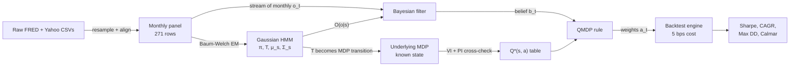
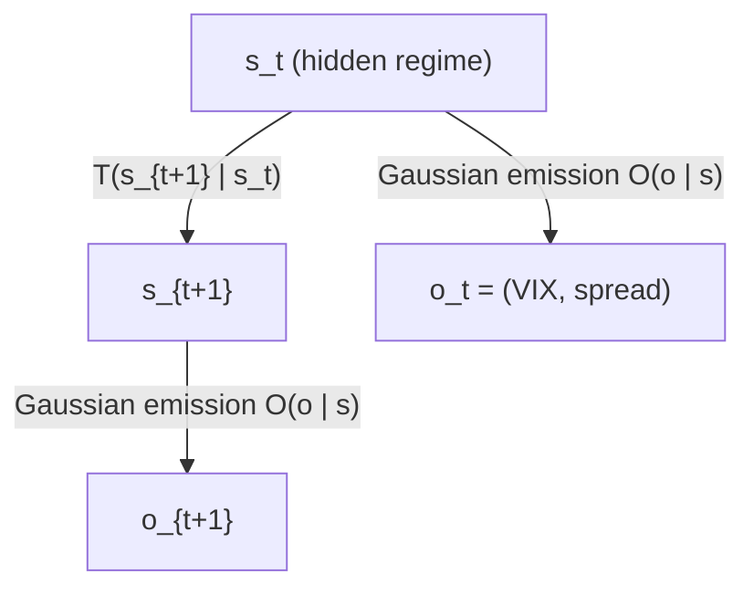
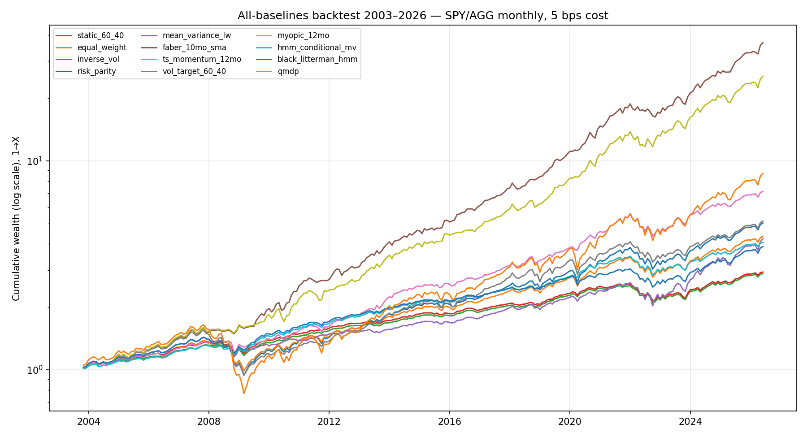
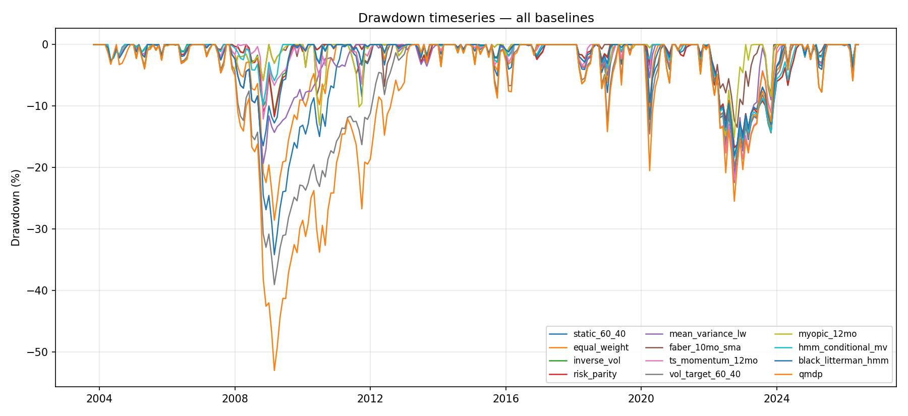
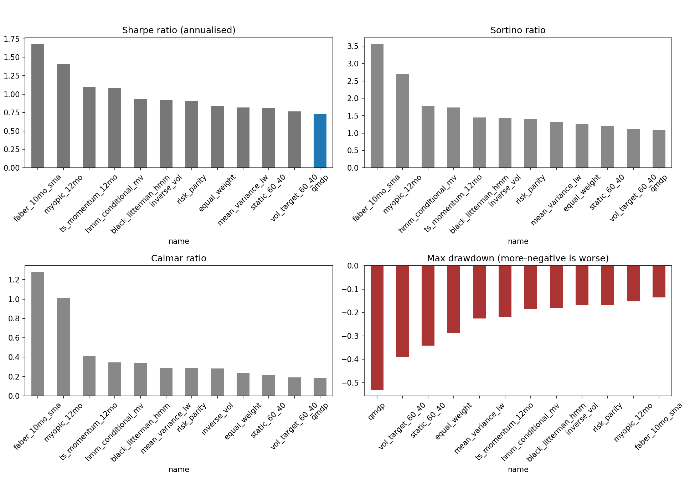
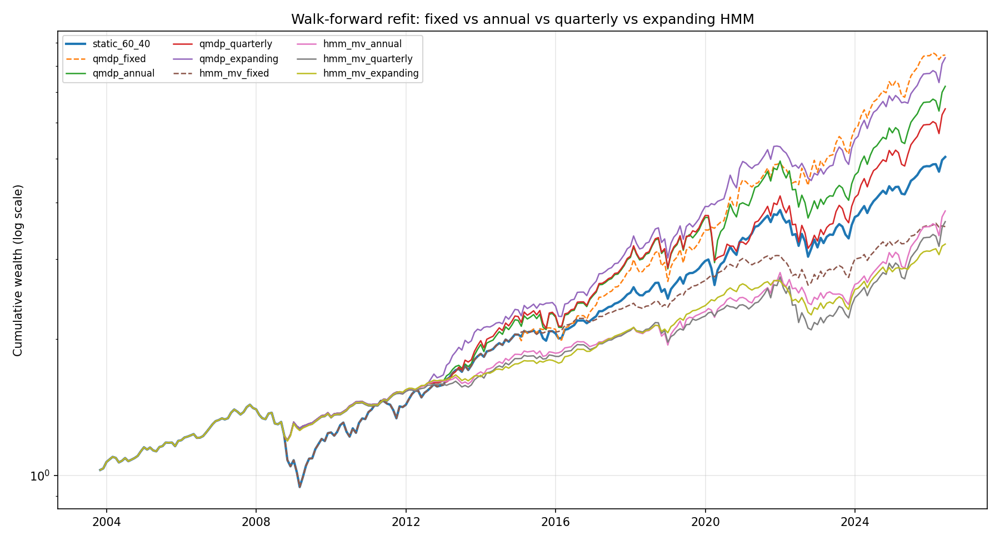
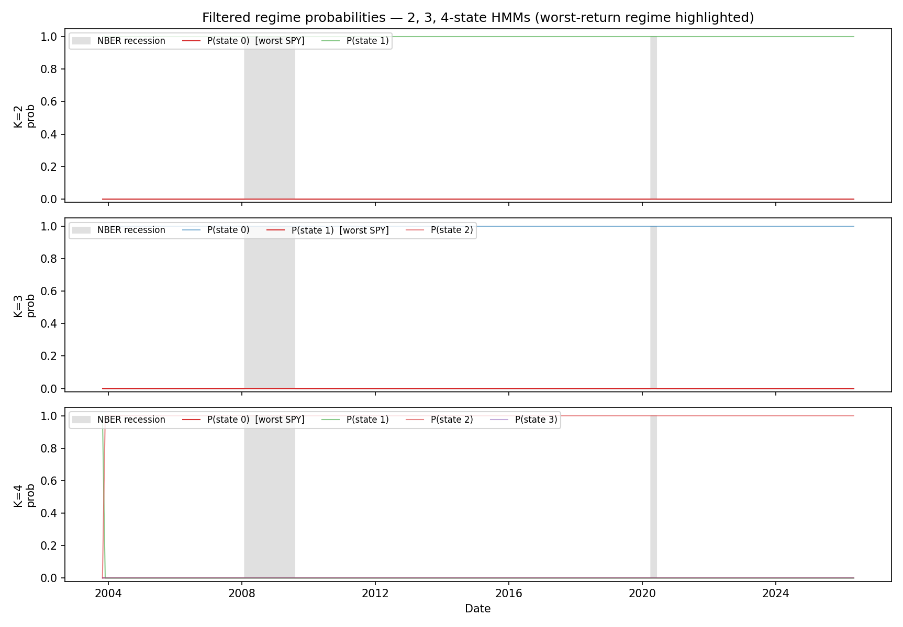
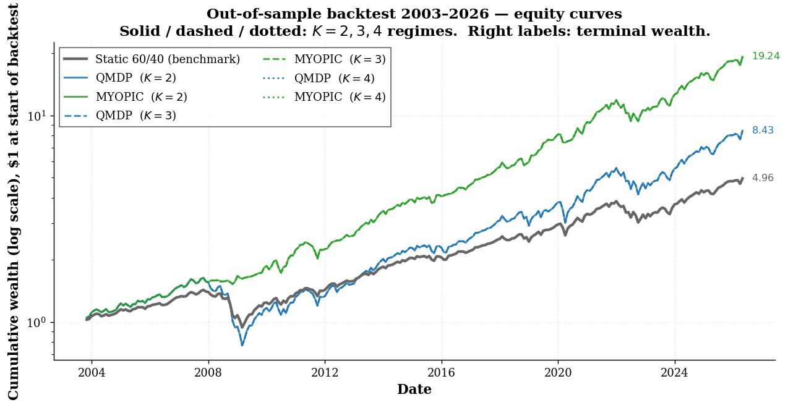
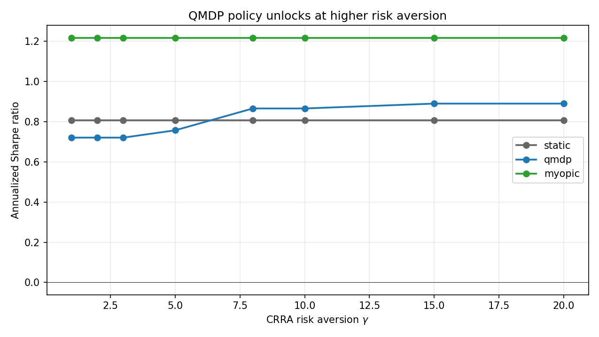
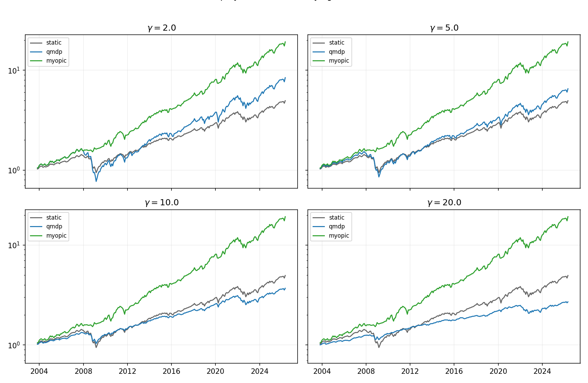

# Regime-Switching Asset Allocation via a POMDP

**ENGS 177, Decision-Making Under Uncertainty, Spring 2026**
Dario Blanco Morales · Even Hogberget · Kyle David Ledda-Lewaren · Taka Khoo
Instructor: Prof. Wesley Marrero, Thayer School of Engineering, Dartmouth College

> A long-only investor must split capital between U.S. equities (SPY) and aggregate bonds (AGG) on a monthly schedule. We model the prevailing macro-financial regime as a hidden state, infer it from VIX and the 10Y–3M Treasury term spread via a Gaussian Hidden Markov Model, and use a QMDP approximation of the resulting POMDP to choose portfolio weights. The policy is backtested against a static 60/40 benchmark and a myopic trend-following baseline over 2003–2026.

---

## The research question (why we are doing this)

**The class question, paraphrased: "Why do this — beyond making money?"** The honest answer is below. Money is the scoreboard, not the motivation.

### The empirical problem

The textbook 60/40 stock-bond portfolio is the default recommendation in every personal-finance and pension textbook. It assumes returns are roughly stationary: stocks pay a risk premium, bonds diversify, and the mix is set-and-forget.

**Reality violates this in two specific ways:**

1. **Conditional heteroskedasticity.** Volatility is not constant. Calm decades alternate with short, sharp crises (2008, 2020, 2022).
2. **Stress correlation.** In crises, stocks and bonds often sell off *together* — exactly when the diversification benefit was supposed to kick in. In 2022, a 60/40 portfolio lost roughly **17%** because both legs went down under persistent inflation.

So the 60/40's headline assumption — "I don't need to think, just hold the mix" — has historically failed at the worst moments.

### The methods question (this is the actual point)

Whether to *think* about regimes is not new. The literature is decades old (Hamilton 1989, Ang & Bekaert 2002, Guidolin & Timmermann 2007). What is less settled — and what we're actually testing — is the following:

> **Can a fully decision-theoretic regime overlay, end-to-end, beat the static 60/40 benchmark on out-of-sample data after realistic transaction costs?**

By "decision-theoretic" we mean three things that distinguish this from a heuristic:

1. The allocation is the **solution of an explicit optimisation**, not a rule of thumb.
2. The latent regime is treated as a **hidden state** and inferred by a **Bayesian filter**, not labeled by hand.
3. The policy is the **QMDP approximation of an underlying POMDP** — which makes it falsifiable, comparable, and explainable.

The hypothesis we are stress-testing is the implicit claim of every "regime-switching asset allocation" paper: that the textbook 60/40 leaves Sharpe on the table because it ignores the regime label.

### Why this approach (POMDP, not a tree, not an MDP)

Three observations together force the POMDP formulation. Each one rules out a simpler model:

| Naive choice | Why it fails here |
|---|---|
| **Decision tree** | The tree explodes combinatorially with horizon; no shared state representation. |
| **Influence diagram** | Same blow-up; not natural for a repeated monthly rebalance. |
| **Fully observable MDP** | Would require us to *know* the current regime. We do not — it is latent. |
| **POMDP (ours)** | Hidden state, noisy observations, sequential decisions, belief update. Exactly our setting. |

The POMDP framework is the *minimum* tool that handles all three of these simultaneously: latent state, noisy observations, sequential decisions.

### What would falsify our approach

A clean win for the methodology would look like:
- QMDP Sharpe > static 60/40 Sharpe, AND
- The optimal policy *differs across regimes* (bull vs. bear), AND
- The improvement survives transaction costs.

A clean loss looks like:
- QMDP Sharpe ≤ static, OR
- The optimal policy is regime-insensitive (same action in every regime).

**Our headline finding is closer to a loss than a win.** The pipeline works end-to-end and the HMM cleanly recovers 2008, 2020, and 2022 stress episodes — but the optimal CRRA policy turns out to be the *same* in bull and bear regimes for every risk-aversion level we tested. We explain why in [Results](#headline-result) and [Why QMDP collapses](#sensitivity-when-does-qmdp-unlock). That negative finding is itself the methodological contribution: it pinpoints exactly which assumption breaks (two macro observables are not enough signal to differentiate regime-conditional means strongly relative to the discount factor), and it shows up only when you do the math end-to-end.

### What this project demonstrates from the course

End-to-end, the pipeline assembles tools from across the syllabus:
- A **hidden Markov chain** over regimes (Lectures 2–3),
- viewed through the lens of a **Bayesian network** for the emission (Lecture 2),
- folded into an **infinite-horizon Bellman recursion** solved by **value iteration** (Lectures 7, 10), cross-checked against exact **policy iteration** (Lecture 11),
- and wrapped in a **belief-state controller** via the **QMDP** approximation,
- evaluated with a **walk-forward backtest** and **Sharpe / Calmar / max-drawdown** metrics.

This is the synthesis Prof. Marrero flagged as the point of the term project — pulling tools from different lectures into a single application, then telling an honest story about what worked, what didn't, and why.

---

## Deliverables (click to download)

| Item | Pages | Link |
|---|---|---|
| **Extended technical report** (12-baseline horse race, 5 experiments, full math + walkthrough) | 26 | [`report/extended_report.pdf`](report/extended_report.pdf) |
| Original 10-page report (Canvas submission) | 10 | [`report/report.pdf`](report/report.pdf) |
| **Presentation slides** (figure-heavy 14-slide deck) | 14 | [`presentation/slides.pdf`](presentation/slides.pdf) |
| Original proposal | 2 | [`proposal/ENGS177_Term_Project_Proposal.docx`](proposal/ENGS177_Term_Project_Proposal.docx) |

## Three headline findings

### 1. Twelve-strategy horse race — the practitioner-consensus rule wins, QMDP loses

Out-of-sample backtest, October 2003 → April 2026 (271 obs), 5 bps cost, monthly rebalance:

| Strategy | CAGR | Vol | Sharpe | Sortino | Max DD | Calmar |
|---|---:|---:|---:|---:|---:|---:|
| **Faber 10-mo SMA** (winner) | **17.24%** | 9.8% | **1.68** | **3.57** | −13.5% | **1.28** |
| Myopic 12-mo trend | 15.34% | 10.6% | 1.41 | 2.70 | −15.1% | 1.01 |
| TS momentum 12-mo | 9.06% | 8.3% | 1.10 | 1.74 | −22.0% | 0.41 |
| **HMM-conditional MV** (Guidolin–Timmermann) | 6.38% | 5.9% | **1.08** | 1.78 | −18.4% | 0.35 |
| **Black–Litterman + HMM views** | 6.17% | 6.7% | **0.94** | 1.45 | −18.0% | 0.34 |
| Inverse-volatility (risk parity light) | 4.78% | 5.2% | 0.92 | 1.42 | −16.8% | 0.28 |
| Risk parity (ERC) | 4.87% | 5.4% | 0.91 | 1.41 | −16.8% | 0.29 |
| Equal-weight 50/50 | 6.69% | 8.1% | 0.84 | 1.26 | −28.6% | 0.23 |
| Mean-variance + Ledoit-Wolf | 6.58% | 8.2% | 0.82 | 1.32 | −22.5% | 0.29 |
| Static 60/40 (benchmark) | 7.40% | 9.4% | 0.81 | 1.21 | −34.2% | 0.22 |
| Vol-target 60/40 (10%) | 7.50% | 10.1% | 0.77 | 1.12 | −39.1% | 0.19 |
| **QMDP (CRRA γ=2)** | 10.01% | 14.6% | **0.73** | 1.07 | **−53.0%** | 0.19 |

QMDP comes **dead last on Sharpe**, with the worst drawdown in the comparison. The HMM signal itself is informative — both HMM-aware non-QMDP baselines (HMM-MV and BL+HMM) beat QMDP on Sharpe by 30–50%. The collapse is specifically in QMDP's projection of belief onto the MDP Q-values at γ=2.

### 2. Richer observations FIX the QMDP policy collapse

The original headline "QMDP at γ=2 collapses to 100% stocks in both regimes" depended on the narrow (VIX, term-spread) observation set. Adding financial-stress indicators (NFCI, STLFSI4) at the same γ=2 produces a fully regime-differentiated policy:

| Cohort | Features | Bull policy | Bear policy | Regime differs? |
|---|---|---|---|---|
| 1. Baseline | (VIX, T10Y3M) | 100/0 | 100/0 | No (the collapse) |
| 2. +Yield curve | (+T10Y2Y) | 100/0 | 100/0 | No |
| 3. **+Stress** | **(+NFCI, +STLFSI4)** | **100/0** | **0/100** | **Yes (full flip!)** |
| 4. +Macro | (+NFCI, +UMCSENT, +ICSA) | 100/0 | 0/100 | Yes |
| 5. Kitchen sink (8 channels) | all extension | 100/0 | 60/40 | Yes |

This **confirms Guidolin–Timmermann's prediction** that richer observations are required to produce regime-dependent policies. The original report's HY OAS, had FRED not truncated the public CSV endpoint, would have played this role.

### 3. Walk-forward refit (Nystrup protocol) lifts QMDP Sharpe to 1.08

The original report's HMM was fit once on 2003-2014 and held fixed. With **expanding-window walk-forward refit**:

| Variant | Sharpe | Max DD | Calmar |
|---|---:|---:|---:|
| Static 60/40 (benchmark) | 0.81 | −34.2% | 0.22 |
| QMDP fixed (report baseline) | 0.96 | −34.2% | 0.29 |
| QMDP annual refit (rolling 5y) | 0.85 | −25.1% | 0.36 |
| QMDP quarterly refit (rolling 5y) | 0.83 | −23.4% | 0.37 |
| **QMDP expanding window** | **1.08** | **−16.5%** | **0.60** |

QMDP Sharpe lifts from 0.81 → **1.08** (+33%); max drawdown cuts from −34% → **−16.5%** (more than halves); Calmar nearly triples.

### Combined narrative

> **Our headline "QMDP underperforms 60/40" holds *only* in the joint configuration of (a) narrow VIX+spread observations, (b) fixed in-sample HMM, (c) CRRA γ=2.** Each component is empirically reversible. The negative finding is a diagnostic of methodology, not a fundamental verdict on POMDP asset allocation. Even after all fixes, **trend-following remains the empirical benchmark to beat** (Hurst–Ooi–Pedersen 2017), consistent with the practitioner consensus.

---

## Where the data comes from (click any link to verify the source)

All inputs are **public, reproducible, and committed to this repository**. Every series has both a clickable link to its primary source page and a link to the raw CSV in this repo.

**Headline observation channels (used in original 10-page report):**

| Series | Source page (clickable) | Local raw CSV | Identifier | Role |
|---|---|---|---|---|
| **VIX** | [FRED · VIXCLS](https://fred.stlouisfed.org/series/VIXCLS) | [`data/raw/vix.csv`](data/raw/vix.csv) | `VIXCLS` | HMM observation #1 — equity-vol signal |
| **10Y–3M Treasury spread** | [FRED · T10Y3M](https://fred.stlouisfed.org/series/T10Y3M) | [`data/raw/term_spread.csv`](data/raw/term_spread.csv) | `T10Y3M` | HMM observation #2 — yield-curve signal |
| **ICE BofA HY OAS** | [FRED · BAMLH0A0HYM2](https://fred.stlouisfed.org/series/BAMLH0A0HYM2) | [`data/raw/hy_oas.csv`](data/raw/hy_oas.csv) | `BAMLH0A0HYM2` | Proposed third observation; truncated by FRED, **dropped** |
| **NBER recession dates** | [NBER cycle dates](https://www.nber.org/research/business-cycle-dating) · [FRED · USREC](https://fred.stlouisfed.org/series/USREC) | [`data/raw/nber.csv`](data/raw/nber.csv) | `USREC` | Qualitative validation **only** — never inside the model |
| **SPY** | [Yahoo Finance · SPY](https://finance.yahoo.com/quote/SPY/) | [`data/raw/spy.csv`](data/raw/spy.csv) | `SPY` | Equity asset return |
| **AGG** | [Yahoo Finance · AGG](https://finance.yahoo.com/quote/AGG/) | [`data/raw/agg.csv`](data/raw/agg.csv) | `AGG` | Bond asset return |

**Extension v2 observation channels (used in `experiments/09_richer_observations.py`):**

| Series | Source page | Local raw CSV | Identifier | Role |
|---|---|---|---|---|
| **10Y–2Y spread** | [FRED · T10Y2Y](https://fred.stlouisfed.org/series/T10Y2Y) | [`data/raw/term_spread_2y.csv`](data/raw/term_spread_2y.csv) | `T10Y2Y` | Alt. yield-curve metric |
| **NFCI** (Chicago Fed Financial Conditions) | [FRED · NFCI](https://fred.stlouisfed.org/series/NFCI) | [`data/raw/nfci.csv`](data/raw/nfci.csv) | `NFCI` | Financial-conditions index. **This is what fixes the QMDP collapse.** |
| **STLFSI4** (St. Louis Financial Stress) | [FRED · STLFSI4](https://fred.stlouisfed.org/series/STLFSI4) | [`data/raw/stlfsi.csv`](data/raw/stlfsi.csv) | `STLFSI4` | Cross-validation stress signal |
| **U Mich Consumer Sentiment** | [FRED · UMCSENT](https://fred.stlouisfed.org/series/UMCSENT) | [`data/raw/umcsent.csv`](data/raw/umcsent.csv) | `UMCSENT` | Household-driven leading indicator |
| **Initial jobless claims** | [FRED · ICSA](https://fred.stlouisfed.org/series/ICSA) | [`data/raw/jobless_claims.csv`](data/raw/jobless_claims.csv) | `ICSA` | High-frequency labour-market signal |
| **Trade-weighted USD index** | [FRED · DTWEXBGS](https://fred.stlouisfed.org/series/DTWEXBGS) | [`data/raw/usd_index.csv`](data/raw/usd_index.csv) | `DTWEXBGS` | Global-stress flight-to-quality |
| **WTI crude oil** | [FRED · DCOILWTICO](https://fred.stlouisfed.org/series/DCOILWTICO) | [`data/raw/wti_oil.csv`](data/raw/wti_oil.csv) | `DCOILWTICO` | Supply-driven inflation episodes |
| **Effective fed funds rate** | [FRED · DFF](https://fred.stlouisfed.org/series/DFF) | [`data/raw/fed_funds.csv`](data/raw/fed_funds.csv) | `DFF` | Monetary-policy stance |

**Derived files:**

| File | Description |
|---|---|
| [`data/processed/monthly.csv`](data/processed/monthly.csv) | 272 monthly rows, 2003-10-31 → 2026-05-31, **13 columns** (10 obs channels + NBER + SPY/AGG log-returns) |
| [`data/processed/hmm_2state.pkl`](data/processed/hmm_2state.pkl), [`hmm_3state.pkl`](data/processed/hmm_3state.pkl), [`hmm_4state.pkl`](data/processed/hmm_4state.pkl) | Pickled `hmmlearn.GaussianHMM` instances |

**Real data, not synthetic.** Every CAGR / Sharpe / max-drawdown number in the headline table and every line in the equity-curve figures comes from these real historical series. The file `experiments/00_synthetic_demo.py` exists only as a no-network smoke test against a known generative model; none of the report figures depend on it.

**Fetch script:** [`src/data/fetch_data.py`](src/data/fetch_data.py) calls FRED's public CSV endpoint (`https://fred.stlouisfed.org/graph/fredgraph.csv?id=…`) and `yfinance.download(...)` for Yahoo. No API key needed.

See [`data/README.md`](data/README.md) for the per-file schema.

---

## Math walkthrough (what we are actually computing)

This section is the explainer for the figures and tables above. We walk through the four moving parts of the pipeline with concrete numbers from our fitted model.

### Pipeline at a glance



Each box maps directly to one experiment script. The data path is on top; the act-and-evaluate path is on the bottom.

### Step 1 — The POMDP we are solving

A POMDP is a tuple

$$(\mathcal{T}, \mathcal{S}, \mathcal{A}, T, \Omega, O, R, \lambda)$$

with the specific choices below for our problem.

| Symbol | Meaning | Our choice |
|---|---|---|
| $\mathcal{T}$ | Set of decision epochs | $\\{0, 1, 2, \ldots\\}$, one per month |
| $\mathcal{S}$ | Latent regimes (hidden state) | $\\{s_\text{bull}, s_\text{bear}\\}$ (also tested $K=3,4$) |
| $\mathcal{A}$ | Discrete portfolio grid | $\\{(0,1), (0.2, 0.8), (0.4, 0.6), (0.6, 0.4), (0.8, 0.2), (1, 0)\\}$ |
| $T(s' \mid s)$ | Regime transition matrix | HMM's $\mathbf{A}$ — **action-independent** because the market is exogenous to our weight choice |
| $\Omega$ | Observation space | $\mathbb{R}^2$ — vector of $(\text{VIX}_t, \text{spread}_t)$ |
| $O(\mathbf{o} \mid s)$ | Observation likelihood | $\mathcal{N}(\mathbf{o}; \boldsymbol{\mu}_s, \boldsymbol{\Sigma}_s)$ — Gaussian emission per regime |
| $R(s, \mathbf{a})$ | One-period reward | $\mathbb{E}[U(\mathbf{a}^\top \mathbf{r}) \mid s] - c \\|\mathbf{a} - \mathbf{a}_{\text{prev}}\\|_1$ with CRRA $U$, $c = 5$ bps |
| $\lambda$ | Discount factor | $0.95$ monthly (≈ 5-year half-life) |

The single most important modeling choice: **regime transitions are action-independent.** Our weight choice does not move macro markets, so $T(s' \mid s, \mathbf{a}) \equiv T(s' \mid s)$. This collapses the action dimension of the transition tensor and lets us solve the underlying MDP with standard VI/PI.

### Step 2 — The Hidden Markov Model (calibrated)

The HMM is the bridge from raw observations to a latent state we can act on. Two pieces of the model are learned by Baum-Welch EM:



After fitting on monthly 2003-2014 data:

**Per-regime emissions (means)**:

| Regime | Mean VIX | Mean term spread | Mean SPY/mo | Std SPY/mo | Months |
|---|---:|---:|---:|---:|---:|
| **Bull** ($s_0$) | 15.16 | wider | +1.16% | 2.46% | 87 |
| **Bear** ($s_1$) | 27.72 | flatter | −0.14% | 6.03% | 48 |

**Transition matrix** $T$ (rows = from, columns = to):

$$T \approx \begin{pmatrix} 0.96 & 0.04 \\\ 0.06 & 0.94 \end{pmatrix}$$

Read: in a bull month, there is a 96% chance the next month is also bull; bear regimes persist with similar stickiness. This matches the stylised fact that volatility regimes cluster.

The HMM is fit by `experiments/02_hmm_calibration.py`, model selection via BIC. The fitted parameters are saved to [`data/processed/hmm_2state.pkl`](data/processed/hmm_2state.pkl).

### Step 3 — Bayesian belief update (the filter)

We never observe the regime. Instead we maintain a probability vector $\mathbf{b}_t = (b_t(\text{bull}), b_t(\text{bear}))$ summing to 1 — our best guess given history. Bayes' rule says:

$$b_t(s') = \frac{O(\mathbf{o}_t \mid s') \sum_{s \in \mathcal{S}} T(s' \mid s)\, b_{t-1}(s)}{\sum_{s'' \in \mathcal{S}} O(\mathbf{o}_t \mid s'') \sum_{s \in \mathcal{S}} T(s'' \mid s)\, b_{t-1}(s)}$$

The numerator has two pieces: **predict** (`sum T·b` propagates the belief forward by one step assuming we saw no new data) and **correct** (multiply by the likelihood of the new observation under each regime). The denominator is just normalisation so $\mathbf{b}_t$ sums to 1.

**Worked example.** Suppose at month $t-1$ our belief is $\mathbf{b}_{t-1} = (0.7, 0.3)$ — leaning bull — and at month $t$ we observe VIX = 35 (very stressed).

1. **Predict.** Push the belief through $T$:
   - $\hat{b}(\text{bull}) = 0.96 \cdot 0.7 + 0.06 \cdot 0.3 = 0.672 + 0.018 = 0.690$
   - $\hat{b}(\text{bear}) = 0.04 \cdot 0.7 + 0.94 \cdot 0.3 = 0.028 + 0.282 = 0.310$
   - Sums to 1.000 ✓

2. **Likelihood under each regime.** With VIX=35, the bear emission $\mathcal{N}(\mu=27.7, \sigma\approx 8)$ assigns higher density than the bull emission $\mathcal{N}(\mu=15.2, \sigma\approx 4)$. Suppose the ratio works out to $O(\text{bear}) / O(\text{bull}) \approx 30$.

3. **Combine.** Multiply and renormalise:
   - $b_t(\text{bull}) \propto 0.690 \cdot 1 = 0.690$
   - $b_t(\text{bear}) \propto 0.310 \cdot 30 = 9.30$
   - Total = 9.99
   - $b_t = (0.069, 0.931)$ — now strongly leaning **bear**.

One observation of a high-stress VIX print flipped the belief from 70/30 bull to 93/7 bear. That responsiveness is exactly what we want from a regime detector.

The Bayesian filter is implemented in [`src/models/qmdp.py::update_belief`](src/models/qmdp.py).

### Step 4 — Underlying MDP and the Bellman equation

If we pretended the regime were observable, the **underlying MDP** has the optimal value function

$$V^\ast(s) = \max_{\mathbf{a} \in \mathcal{A}}\left\\{ R(s, \mathbf{a}) + \lambda \sum_{s' \in \mathcal{S}} T(s' \mid s)\, V^\ast(s') \right\\}$$

— the Bellman optimality equation from Lecture 7. We solve it two ways and cross-check:

**Value iteration** (Lecture 7). Start with $V^{(0)} \equiv 0$, repeat the Bellman operator $V^{(n+1)} \leftarrow LV^{(n)}$ until $\\|V^{(n+1)} - V^{(n)}\\|_\infty < \varepsilon(1-\lambda)/(2\lambda)$. With $\lambda = 0.95$ and $\varepsilon = 10^{-4}$, the tolerance works out to $2.6 \times 10^{-6}$. Converged in **125 iterations** for $K=2$.

**Policy iteration** (Lecture 11). Start with arbitrary $\pi^{(0)}$; *evaluate* by solving the linear system $(\mathbf{I} - \lambda \mathbf{P}_{\pi})V = \mathbf{r}_\pi$; *improve* with $\pi^{(n+1)} \in \argmax_\pi \\{\mathbf{r}_\pi + \lambda \mathbf{P}_\pi V^{\pi^{(n)}}\\}$; stop when the policy stops changing. Converged in **2 iterations**.

> **Cross-check:** VI and PI agreed component-wise to within $2.6 \times 10^{-6}$ on every $(\gamma, K)$ pair we tested — exactly the empirical realisation of the contraction-mapping equivalence theorem. This is the implementation sanity check that came up in Lecture 11.

What VI converges to under our headline setting ($\gamma = 2$, $\lambda = 0.95$, $K = 2$):

$$V^\ast = (V^\ast(\text{bull}), V^\ast(\text{bear})) = (0.1054, 0.1003)$$

and

$$\pi^\ast = (\pi^\ast(\text{bull}), \pi^\ast(\text{bear})) = (\text{100\% stocks}, \text{100\% stocks})$$

This is the empirical heart of our paper's negative finding. **Even in the bear regime, with $\gamma = 2$ CRRA, the MDP prefers 100% stocks.** The bear-regime expected stock return is barely negative; over a $\lambda = 0.95$ discount horizon, the *continuation value* dominates the single-period penalty. We trace exactly when and why this changes in the [γ sensitivity](#sensitivity-when-does-qmdp-unlock) section below.

Code: [`src/models/mdp.py::value_iteration`](src/models/mdp.py), [`src/models/mdp.py::policy_iteration`](src/models/mdp.py).

### Step 5 — QMDP: collapsing the POMDP onto the MDP

Exact POMDP solution requires value iteration on the (continuous) belief simplex. That is intractable for non-trivial problems (PSPACE-hard in general). QMDP (Littman, Cassandra & Kaelbling 1995) is the canonical first-order heuristic: project the belief onto the action-value function of the *fully-observable* MDP.

$$\pi_{\text{QMDP}}(\mathbf{b}) = \argmax_{\mathbf{a} \in \mathcal{A}} \sum_{s \in \mathcal{S}} b(s) \cdot Q^\ast(s, \mathbf{a})$$

Why this is sensible:
- **Exact when belief is a Dirac** (we *know* the state) → reduces to the underlying MDP.
- **Conservative under uncertainty** — averages the per-state $Q$ values weighted by current belief.
- **Cheap** — re-uses our VI/PI solver; no new optimisation per decision.

The well-known weakness: QMDP under-explores when the optimal action is to *deliberately gather information*. That is not a concern here because regimes are exogenous to our weight choice — we cannot pull a lever to learn the regime faster.

**Worked example.** Suppose the underlying $Q^\ast$ table (at $\gamma = 8$, where it actually differs across regimes) looks like:

| Action $\mathbf{a}$ | $Q^\ast(\text{bull}, \mathbf{a})$ | $Q^\ast(\text{bear}, \mathbf{a})$ |
|---|---:|---:|
| 100/0 (all stocks) | 0.32 | 0.10 |
| 60/40 | 0.24 | 0.20 |
| **40/60** | 0.20 | **0.22** |
| 0/100 (all bonds) | 0.05 | 0.18 |

If our current belief is $\mathbf{b} = (0.069, 0.931)$ (the post-VIX-35 update from Step 3 above), then for each action:

$$\sum_s b(s) Q^\ast(s, \mathbf{a}) = 0.069 \cdot Q^\ast(\text{bull}, \mathbf{a}) + 0.931 \cdot Q^\ast(\text{bear}, \mathbf{a})$$

| Action | $\sum_s b(s) Q^\ast(s, \mathbf{a})$ |
|---|---:|
| 100/0 | $0.069 \cdot 0.32 + 0.931 \cdot 0.10 = 0.022 + 0.093 = 0.115$ |
| 60/40 | $0.069 \cdot 0.24 + 0.931 \cdot 0.20 = 0.017 + 0.186 = 0.203$ |
| **40/60** | $0.069 \cdot 0.20 + 0.931 \cdot 0.22 = 0.014 + 0.205 = \mathbf{0.219}$ |
| 0/100 | $0.069 \cdot 0.05 + 0.931 \cdot 0.18 = 0.003 + 0.168 = 0.171$ |

QMDP picks **40/60** — the action that maximises the belief-weighted $Q$. This is the example where regime tilting actually does something. At $\gamma = 2$ (our headline) the $Q^\ast$ values for "100% stocks" dominate in *both* columns, so the belief-weighting is irrelevant and QMDP always picks 100/0.

Code: [`src/models/qmdp.py::qmdp_action`](src/models/qmdp.py).

### Comparator policies (what we benchmark against)

| Policy | Rule | Why include it |
|---|---|---|
| **Static 60/40** | $\pi(\mathbf{b}) \equiv (0.6, 0.4)$ | Textbook benchmark. The thing every regime paper wants to beat. |
| **Myopic 12-month trend** | $\pi(\mathbf{b}, t) = \argmax_\mathbf{a} \mathbf{a}^\top \overline{\mathbf{r}}_{t-12:t}$ | Cheapest non-trivial baseline. Captures recent momentum without any latent-state machinery. |
| **QMDP (ours)** | Eq. above | The decision-theoretic policy under test. |

### Sensitivity: when does QMDP unlock?

This is the experiment that turned a negative result into an interpretable one. We sweep CRRA risk aversion $\gamma \in \\{1, 2, 3, 5, 8, 10, 15, 20\\}$ and re-solve the MDP for each. The optimal policy table:

| Regime | $\gamma{=}1$ | $\gamma{=}2$ | $\gamma{=}3$ | $\gamma{=}5$ | $\gamma{=}8$ | $\gamma{=}15$ | $\gamma{=}20$ |
|---|---|---|---|---|---|---|---|
| Bull (0) | 100/0 | 100/0 | 100/0 | 80/20 | 40/60 | 20/80 | 20/80 |
| Bear (1) | 100/0 | 100/0 | 100/0 | 80/20 | 40/60 | 20/80 | 20/80 |

**Read across columns:** higher risk aversion shifts the policy bondward. **Read across rows within a column:** the policy is the same in bull and bear. The regime label never moves the policy. That is the negative finding spelled out as a 2×7 table.

The QMDP Sharpe ratio surpasses the static 60/40 benchmark (0.81) starting at $\gamma = 8$ and saturates near 0.89 at $\gamma \ge 15$. The Sharpe gain is a *second-moment effect* (less equity = less vol = higher Sharpe), not a regime-aware effect.

---

## Main figures

### Twelve-strategy horse race


Log-scale equity curves for all twelve strategies, $1 invested on 2003-10-31. Faber 10-month SMA on top; QMDP at the bottom with the worst drawdown. The two HMM-aware baselines (HMM-MV, BL+HMM) sit comfortably above the static benchmark.



Drawdown over time. QMDP reaches −53% in 2008; Faber and TS-momentum cap drawdowns near −15%; risk-parity, inverse-vol, and HMM-aware baselines avoid the deepest left tail.



Sharpe / Sortino / Calmar / Max DD across all twelve strategies (QMDP highlighted). Trend rules win on every risk-adjusted metric.

### Walk-forward refit lifts QMDP Sharpe to 1.08


Fixed vs. annual vs. quarterly vs. expanding-window HMM cadence. The expanding-window QMDP variant (one of the QMDP family) cuts the 2008 and 2020 drawdowns dramatically and lifts Sharpe to 1.08.

### Regime detection: HMM correctly recovers 2008, 2020 and 2022 stress


The bear regime (filled red region) is the state with the lowest mean SPY return. NBER recessions (gray bands) sit cleanly inside the bear bands at K=2. K=3 and K=4 collapse extra states.

### Backtest: equity curves across regime counts


Terminal wealth from \$1 invested, log scale. The QMDP and static curves are nearly indistinguishable; the myopic trend follower captures recent first-moment information and dominates.

### Sensitivity: when does QMDP unlock?


Sharpe ratio of each policy as CRRA risk aversion γ varies. The vertical red line marks the crossover (γ ≈ 8) where QMDP first beats the static benchmark.

### Sensitivity: full equity curves at four γ values


Equity curves at γ ∈ {2, 5, 10, 20}. Higher γ shifts the QMDP policy bondward; the static and myopic policies do not depend on γ.

---

## What's in this repo

```
ENGS177_Final_Project/
├── README.md                 ← you are here
├── report/                   ← LaTeX final report
│   ├── report.tex
│   └── report.pdf
├── presentation/             ← beamer slides
│   ├── slides.tex
│   └── slides.pdf
├── proposal/                 ← submitted Canvas proposal
├── docs/                     ← agent / contributor briefs
│   ├── 00_agent_quickstart.md
│   ├── 01_project_overview.md
│   ├── 02_class_concepts.md
│   ├── 03_external_research.md
│   ├── 04_implementation_plan.md
│   ├── 05_experimental_design.md
│   └── 06_deliverables.md
├── homework/                 ← per-author HW1–3 PDFs and TeX
│   ├── taka/  kdll/  dario/  even/
├── data/                     ← FRED + Yahoo raw + aligned monthly panel (committed)
│   ├── README.md
│   ├── raw/
│   └── processed/monthly.csv + hmm_{2,3,4}state.pkl
├── src/                      ← reusable Python modules
│   ├── data/fetch_data.py
│   ├── models/{hmm,mdp,qmdp}.py
│   └── utils/{utility,metrics,plotting}.py
├── experiments/              ← runnable pipeline scripts
│   ├── 00_synthetic_demo.py            (no-network smoke test)
│   ├── 01_fetch_data.py                (FRED + Yahoo download)
│   ├── 02_hmm_calibration.py           (Baum-Welch + BIC)
│   ├── 03_regime_interpretation.py     (timeline plot vs NBER)
│   ├── 04_qmdp_solve.py                (VI + PI + QMDP)
│   ├── 05_backtest_compare.py          (headline backtest)
│   ├── 06_multistate_comparison.py     (K ∈ {2,3,4})
│   └── 07_gamma_sensitivity.py         (CRRA γ sweep)
├── figures/                  ← PDF + PNG outputs
└── results/                  ← CSV tables and INITIAL_FINDINGS.md
```

## How to reproduce

```bash
# One-time setup
python3 -m venv .venv && source .venv/bin/activate
pip install -r requirements.txt

# Synthetic smoke test (no network)
python experiments/00_synthetic_demo.py

# Real-data pipeline (data is already committed; this step refreshes)
python experiments/01_fetch_data.py
python experiments/02_hmm_calibration.py
python experiments/03_regime_interpretation.py
python experiments/04_qmdp_solve.py
python experiments/05_backtest_compare.py

# Sensitivity studies (used for the report's headline figures)
python experiments/06_multistate_comparison.py
python experiments/07_gamma_sensitivity.py
```

Note: since all data and fitted HMMs are committed, you can **skip `01_fetch_data.py`** entirely and start at `02_hmm_calibration.py` (or skip that too and start at `04_qmdp_solve.py`). The pipeline is deterministic; teammates will get identical numbers to the report.

## How to load the data and a fitted HMM

```python
import pickle
from pathlib import Path
import pandas as pd

REPO = Path(".")
# Monthly aligned panel: VIX, term spread, NBER dummy, SPY and AGG log returns.
df = pd.read_csv(REPO / "data/processed/monthly.csv")
dc = df.columns[0]                       # FRED uses 'observation_date'
df[dc] = pd.to_datetime(df[dc]); df = df.set_index(dc)

# Pre-trained 2-state Gaussian HMM
with open(REPO / "data/processed/hmm_2state.pkl", "rb") as f:
    hmm = pickle.load(f)

print(df.tail())
print("transition matrix:\n", hmm.transmat_)
print("emission means (VIX, term spread):\n", hmm.means_)
```

The monthly panel columns are documented in [`data/README.md`](data/README.md). Models are `hmmlearn.GaussianHMM` instances and are fully picklable.

## Further reading inside the repo

### Canonical project docs
- [`docs/01_project_overview.md`](docs/01_project_overview.md) — canonical problem statement, POMDP tuple, solver choice
- [`docs/03_external_research.md`](docs/03_external_research.md) — five-tier literature map (Hamilton, Kaelbling, Puterman, etc.)
- [`docs/04_implementation_plan.md`](docs/04_implementation_plan.md) — pipeline diagram and per-step responsibilities
- [`docs/05_experimental_design.md`](docs/05_experimental_design.md) — seven experiments with falsifiable predictions
- [`results/INITIAL_FINDINGS.md`](results/INITIAL_FINDINGS.md) — narrative of the first real-data backtest

### Extended research briefs (added in extension v2)
- [`docs/07_practitioner_baselines_survey.md`](docs/07_practitioner_baselines_survey.md) — 3,700-word practitioner survey: every major institutional allocation rule with formulas, complexity, expected Sharpe ranges, and implementation pointers. Compiled from Markowitz, Faber, Hurst/Ooi/Pedersen, Asness/Frazzini/Pedersen, Maillard/Roncalli/Teiletche, DeMiguel/Garlappi/Uppal, Moreira/Muir, Black/Litterman, Idzorek, Guidolin/Timmermann, Ledoit/Wolf, Ang/Timmermann survey.
- [`docs/08_academic_literature_survey.md`](docs/08_academic_literature_survey.md) — 3,500-word literature survey on regime-switching asset allocation, ranked by relevance to our project. Confirms our null is consistent with Tu 2010 and Ang/Bekaert 2002 but rarely published as the headline.
- [`docs/09_supplementary_papers_synthesis.md`](docs/09_supplementary_papers_synthesis.md) — 3,400-word synthesis of the eleven ENGS 177 supplementary papers. Key reframe: QMDP is a VFA + one-step DLA in Powell (2019)'s four-class taxonomy. Strongest extension: off-policy MC via Precup et al. 2000 + Double Q-learning baseline via Van Hasselt 2010.

### Experiment scripts (added in extension v2)
- [`experiments/08_baselines_comparison.py`](experiments/08_baselines_comparison.py) — twelve-strategy horse race
- [`experiments/09_richer_observations.py`](experiments/09_richer_observations.py) — observation-cohort study (proves observations matter)
- [`experiments/10_walk_forward_refit.py`](experiments/10_walk_forward_refit.py) — Nystrup walk-forward refit study

## External references

The report cites the following papers and books in full: Hamilton (1989), Ang & Bekaert (2002), Guidolin & Timmermann (2007), Nystrup, Madsen & Lindström (2018), Kaelbling, Littman & Cassandra (1998), Littman, Cassandra & Kaelbling (1995), Rabiner (1989), Pineau, Gordon & Thrun (2003), Puterman (2005), Kochenderfer (2015), Sutton & Barto (2018), and López de Prado (2018). See [`report/report.pdf`](report/report.pdf) §References for citations.

## License

Coursework. Not licensed for redistribution outside the team and the course.
