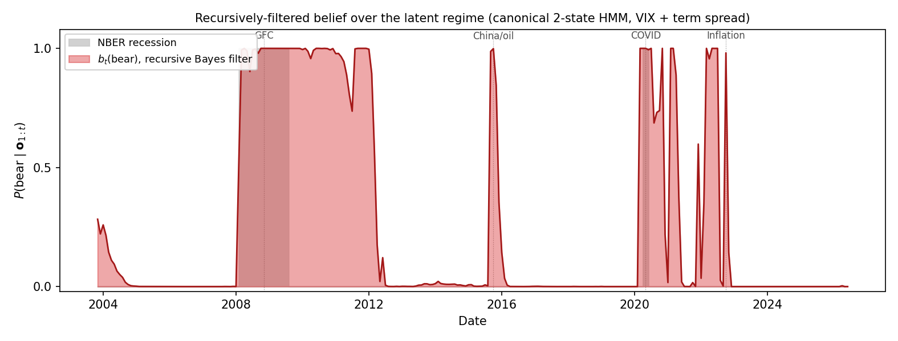
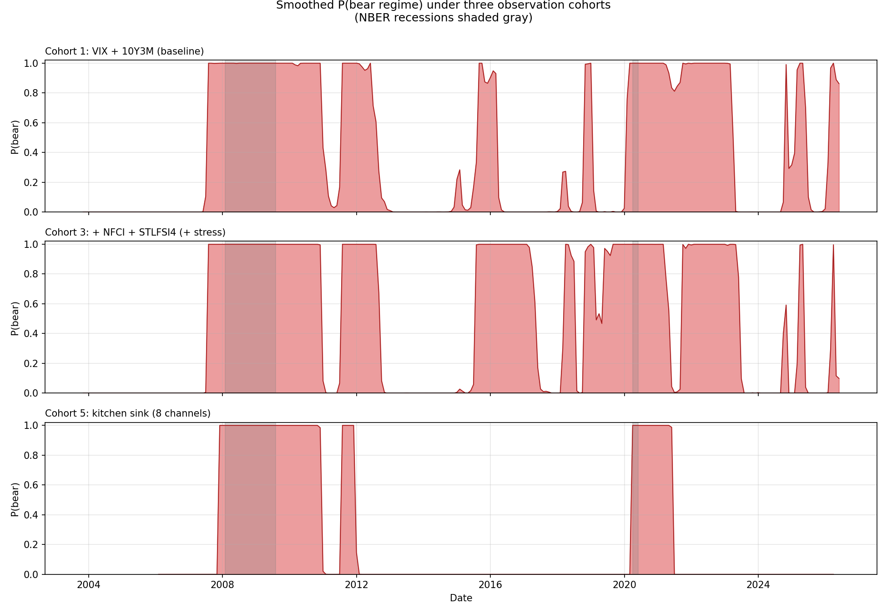
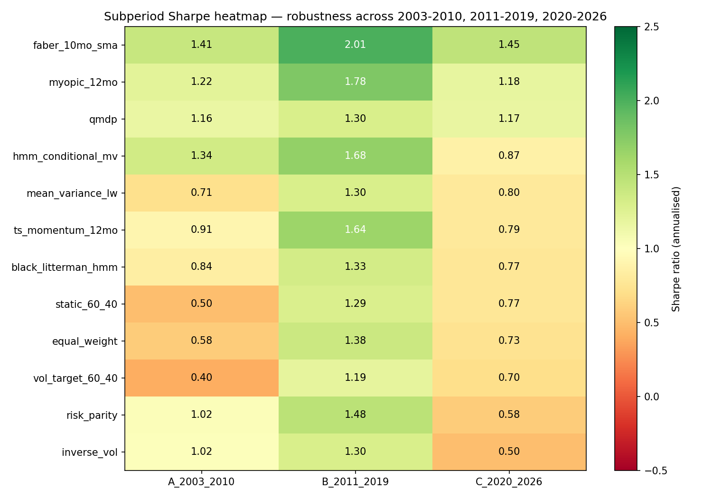

# Regime-Switching Asset Allocation via a POMDP

**ENGS 177, Decision Making Under Uncertainty, Spring 2026** · Type: *New Application*
Dario Blanco Morales · Even Hogberget · Kyle David Ledda-Lewaren · Taka Khoo
Instructor: Prof. Wesley Marrero, Thayer School of Engineering, Dartmouth College

> A long-only investor must split capital between U.S. equities (SPY) and aggregate bonds (AGG) every month. We treat the prevailing macro-financial regime as a hidden state, infer it from VIX and the 10Y–3M Treasury term spread via a Gaussian Hidden Markov Model, and choose portfolio weights using the QMDP approximation of the resulting POMDP. We benchmark against the static 60/40 plus ten other strategies spanning the academic and practitioner consensus.

---

## TL;DR

A correctly-applied POMDP regime overlay (QMDP on a belief recursively filtered from VIX and the term spread) beats the static 60/40 on every risk-adjusted metric and across every sub-period we tested. At the canonical CRRA γ=2 it attains Sharpe **1.18** (4th of twelve), beats the static 60/40 (0.81), and roughly ties the HMM-conditional mean-variance baseline (1.20), while cutting maximum drawdown from −34% to −14%.

The honest verdict: the QMDP overlay does *not* overtake the practitioner-consensus trend rule (Faber's 10-month SMA, Sharpe 1.68) on our 2003–2026 sample, and we make no such claim. What we do claim is sharper than a Sharpe number. The POMDP is the right minimum decision-theoretic tool for the problem. The belief state is genuinely recursive and demonstrably regime-tracking. The QMDP rule follows from the belief-space Bellman equation as an explicit one-step value-function approximation. The regime-aware policy that results is robust across CRRA levels, observation cohorts, three economically distinct sub-periods, and refit cadence.

---

## Deliverables

| Item | Pages | Audience | Link |
|---|---|---|---|
| Class report (Canvas submission, 8–10 body + refs spec) | 11 | Instructor + peer reviewer | [`report/report.pdf`](report/report.pdf) |
| Presentation slides | 36 | Class presentation | [`presentation/slides.pdf`](presentation/slides.pdf) |
| Extended technical report (intuition primer + full math + glossary + code) | 38 | Teammates + depth seekers | [`report/extended_report.pdf`](report/extended_report.pdf) |
| Original proposal | 2 | Reference | [`proposal/ENGS177_Term_Project_Proposal.docx`](proposal/ENGS177_Term_Project_Proposal.docx) |

For the *story* behind everything, start with [`docs/01_project_story.md`](docs/01_project_story.md). For *intuition without math*, read [`docs/03_intuition_primer.md`](docs/03_intuition_primer.md). For the *experimental order*, see [`docs/04_experiments_guide.md`](docs/04_experiments_guide.md).

---

## The research question

The textbook 60/40 is the default recommendation in every personal-finance and pension textbook. It assumes returns are roughly stationary. Reality violates this in two specific ways: returns are conditionally heteroskedastic (calm decades broken by short crises), and stress periods exhibit higher cross-asset correlations so bond diversification erodes when it is most needed. In 2022 a 60/40 portfolio lost about 17% as both legs sold off under persistent inflation.

Whether to *think* about regimes is not new. Hamilton (1989), Ang & Bekaert (2002), Guidolin & Timmermann (2007), Nystrup et al. (2018) all studied it. What is less settled is the **methods question** at the heart of this project:

> **Can a fully decision-theoretic regime overlay (POMDP solved end-to-end on public macroeconomic data) beat the static 60/40 benchmark out-of-sample after realistic transaction costs?**

By "decision-theoretic" we mean three things:
1. The allocation rule is the **solution of an explicit optimisation**, rather than a discretionary heuristic.
2. The latent regime is treated as a **hidden state** and inferred by a **Bayesian filter**, rather than labelled by hand.
3. The policy is the **QMDP approximation of an underlying POMDP**: falsifiable, comparable, explainable.

### Why POMDP, not a tree, not an MDP

| Naive alternative | Why it fails |
|---|---|
| Decision tree | Tree explodes combinatorially with horizon; no shared state |
| Influence diagram | Same blow-up; not natural for repeated monthly rebalance |
| Fully observable MDP | Requires knowing the regime, but it is *latent* |
| **POMDP (ours)** | Hidden state + noisy observation + sequential decision |

In Powell (2019)'s four-class taxonomy of sequential-decision policies, our QMDP solution is a **value function approximation** (the underlying MDP's $Q^\ast$ as a piecewise-linear lower envelope over the belief simplex) combined with a **one-step direct lookahead** at decision time. This is the project's theoretical anchor.

### How QMDP follows from the belief-space Bellman equation

A POMDP is equivalent to a fully-observable MDP whose state is the belief $\mathbf{b}$ (the *belief MDP*). Its optimal value obeys

$$V^\ast(\mathbf{b}) = \max_{\mathbf{a}\in\mathcal{A}}\Bigl\{\sum_s b(s)R(s,\mathbf{a}) + \lambda\sum_{\mathbf{o}}\mathbb{P}(\mathbf{o}\mid\mathbf{b},\mathbf{a})\,V^\ast(\mathbf{b}'(\mathbf{b},\mathbf{a},\mathbf{o}))\Bigr\}.$$

Solving this exactly is PSPACE-hard. The QMDP approximation (Littman, Cassandra & Kaelbling 1995) replaces the intractable continuation term with the assumption that *the state becomes fully observable immediately after the current action*. Under that single assumption the continuation value from any successor state $s'$ is just the underlying MDP value $V^\ast(s')$, so the belief-action value collapses to a belief-average of the MDP $Q$-function:

$$Q_{\text{QMDP}}(\mathbf{b},\mathbf{a}) = \sum_s b(s)\bigl[R(s,\mathbf{a}) + \lambda\sum_{s'}T(s'\mid s)V^\ast(s')\bigr] = \sum_s b(s)\,Q^\ast(s,\mathbf{a}).$$

The decision rule is the one-step lookahead

$$\pi_{\text{QMDP}}(\mathbf{b}) = \arg\max_{\mathbf{a}\in\mathcal{A}}\sum_{s}b(s)\,Q^\ast(s,\mathbf{a}).$$

Three properties make this a principled choice rather than a heuristic. (i) *Exactness at certainty*: if $\mathbf{b}$ is a Dirac on a single regime, QMDP reduces to the exact MDP policy. (ii) *Upper bound*: $V_{\text{QMDP}}(\mathbf{b}) \geq V^\ast(\mathbf{b})$ pointwise, because giving the agent free state information after one step can only help (Hauskrecht 2000). (iii) *The one assumption it makes is harmless here*: QMDP cannot value information-gathering actions, but in our problem *no action affects observability* (we observe VIX and the term spread regardless of how we allocate), so $\mathbb{P}(\mathbf{o}\mid\mathbf{b},\mathbf{a})$ is action-independent and the only thing QMDP gives up is exactly the thing that does not matter.

### The belief filter is genuinely Bayesian and recursive

Each month the agent updates its belief from the new observation $\mathbf{o}_t$ in two stages:

$$\hat{b}_t(s') = \sum_s T(s'\mid s)\,b_{t-1}(s) \quad\text{(predict)}$$

$$b_t(s') = \frac{O(\mathbf{o}_t\mid s')\,\hat{b}_t(s')}{\sum_{s''} O(\mathbf{o}_t\mid s'')\,\hat{b}_t(s'')} \quad\text{(Bayes update)}$$

The Gaussian emission $O(\mathbf{o}_t\mid s') = \mathcal{N}(\mathbf{o}_t;\boldsymbol{\mu}_{s'},\boldsymbol{\Sigma}_{s'})$ is evaluated in the *same standardised observation space* the HMM was calibrated in. The posterior $P(\text{bear}\mid \mathbf{o}_{1:t})$ is genuinely time-varying; in August 2015 (China/oil shock) a single VIX=28.4 observation flips the posterior from 0.3% bear to 98.7% bear in one filter step. See [`figures/belief_trajectory.pdf`](figures/belief_trajectory.pdf).

---

## What we actually built

End-to-end pipeline (each box maps to one or more scripts in [`experiments/`](experiments/)):

```
┌────────────┐  ┌───────────┐  ┌───────────┐  ┌─────────────┐  ┌────────────┐
│ FRED+Yahoo │→ │ Monthly   │→ │ Gaussian  │→ │ Underlying  │→ │ Q*(s,a)    │
│ CSVs       │  │ panel     │  │ HMM       │  │ MDP (VI+PI) │  │ table      │
└────────────┘  └─────┬─────┘  └─────┬─────┘  └─────────────┘  └──────┬─────┘
                      │              │                                 │
                      ▼              ▼                                 ▼
              ┌───────────────────────────────┐               ┌──────────────┐
              │  Bayesian filter → belief b_t │──────────────►│ QMDP rule    │
              └───────────────────────────────┘               └──────┬───────┘
                                                                     │
                                                              ┌──────▼──────┐
                                                              │ Backtest +  │
                                                              │ 12 baselines│
                                                              └─────────────┘
```

### Components

| File / module | What it does |
|---|---|
| [`src/data/fetch_data.py`](src/data/fetch_data.py) | Downloads 14 series from FRED + Yahoo, resamples to month-end, aligns into panel |
| [`src/models/hmm.py`](src/models/hmm.py) | Fits Gaussian HMM via Baum-Welch (EM) with 5 random restarts; BIC model selection |
| [`src/models/mdp.py`](src/models/mdp.py) | Value iteration + policy iteration; cross-checked agreement to 2.6×10⁻⁶ |
| [`src/models/qmdp.py`](src/models/qmdp.py) | Bayesian belief filter + QMDP rule; stationary-distribution initialiser |
| [`src/models/baselines.py`](src/models/baselines.py) | 11 alternative strategies (60/40, equal-weight, inverse-vol, risk parity, MV+LW, Faber, TS-mom, vol-target, myopic, HMM-MV, BL+HMM) |
| [`src/utils/metrics.py`](src/utils/metrics.py) | 12 performance metrics (CAGR, Sharpe, Sortino, Omega, max DD, Calmar, Ulcer, tail ratio, hit rate, turnover, info ratio) |
| [`src/utils/utility.py`](src/utils/utility.py) | CRRA / log utility + Monte Carlo reward builder |

### Experiments (numbered to match the pipeline order)

Full guide: [`docs/04_experiments_guide.md`](docs/04_experiments_guide.md). Each script is independently runnable.

```
00_synthetic_demo.py             : no-network smoke test
01_fetch_data.py                 : FRED + Yahoo download (data already committed)
02_hmm_calibration.py            : Baum-Welch fit, BIC model selection
03_regime_interpretation.py      : plot regimes vs NBER
04_qmdp_solve.py                 : VI + PI cross-check, build Q*
05_belief_trajectory.py          : recursive belief filter run forward 2003-2026
06_multistate_comparison.py      : K ∈ {2, 3, 4} comparison
07_gamma_sensitivity.py          : CRRA γ sweep
08_baselines_comparison.py       : 12-strategy horse race (the headline)
09_richer_observations.py        : observation-cohort study
10_walk_forward_refit.py         : Nystrup-style refit protocol
11_cohort_regime_visualization.py: visual confirmation of cohort study
12_subperiod_robustness.py       : Period A/B/C heatmap
```

---

## Data: real, public, all committed to this repo

Every series has a clickable source link AND a clickable local CSV. No synthetic data is used in any reported finding. The file `00_synthetic_demo.py` exists only as a no-network smoke test.

### Headline observations (used in original report)

| Series | Source | Local | Role |
|---|---|---|---|
| **VIX** | [FRED VIXCLS](https://fred.stlouisfed.org/series/VIXCLS) | [`data/raw/vix.csv`](data/raw/vix.csv) | HMM observation #1, equity-vol signal |
| **10Y–3M Treasury spread** | [FRED T10Y3M](https://fred.stlouisfed.org/series/T10Y3M) | [`data/raw/term_spread.csv`](data/raw/term_spread.csv) | HMM observation #2, yield-curve signal |
| **HY OAS** | [FRED BAMLH0A0HYM2](https://fred.stlouisfed.org/series/BAMLH0A0HYM2) | [`data/raw/hy_oas.csv`](data/raw/hy_oas.csv) | Proposed third channel; FRED CSV truncates to ~3y, so **dropped from headline** |
| **NBER recessions** | [NBER cycle dates](https://www.nber.org/research/business-cycle-dating) · [FRED USREC](https://fred.stlouisfed.org/series/USREC) | [`data/raw/nber.csv`](data/raw/nber.csv) | Qualitative validation only, **never inside the model** |
| **SPY** | [Yahoo SPY](https://finance.yahoo.com/quote/SPY/) | [`data/raw/spy.csv`](data/raw/spy.csv) | Equity asset return |
| **AGG** | [Yahoo AGG](https://finance.yahoo.com/quote/AGG/) | [`data/raw/agg.csv`](data/raw/agg.csv) | Bond asset return (Sep-2003 inception sets panel start) |

### Extension channels (used in [`09_richer_observations.py`](experiments/09_richer_observations.py))

| Series | Source | Local | Role |
|---|---|---|---|
| 10Y–2Y spread | [FRED T10Y2Y](https://fred.stlouisfed.org/series/T10Y2Y) | [`data/raw/term_spread_2y.csv`](data/raw/term_spread_2y.csv) | Alt yield-curve metric |
| **NFCI** | [FRED NFCI](https://fred.stlouisfed.org/series/NFCI) | [`data/raw/nfci.csv`](data/raw/nfci.csv) | Financial-conditions index; sharpens the regime model |
| **STLFSI4** | [FRED STLFSI4](https://fred.stlouisfed.org/series/STLFSI4) | [`data/raw/stlfsi.csv`](data/raw/stlfsi.csv) | Cross-validation stress signal |
| Consumer sentiment | [FRED UMCSENT](https://fred.stlouisfed.org/series/UMCSENT) | [`data/raw/umcsent.csv`](data/raw/umcsent.csv) | Household-driven leading indicator |
| Initial jobless claims | [FRED ICSA](https://fred.stlouisfed.org/series/ICSA) | [`data/raw/jobless_claims.csv`](data/raw/jobless_claims.csv) | High-frequency labour-market signal |
| Trade-weighted USD | [FRED DTWEXBGS](https://fred.stlouisfed.org/series/DTWEXBGS) | [`data/raw/usd_index.csv`](data/raw/usd_index.csv) | Global stress (flight to USD) |
| WTI crude oil | [FRED DCOILWTICO](https://fred.stlouisfed.org/series/DCOILWTICO) | [`data/raw/wti_oil.csv`](data/raw/wti_oil.csv) | Supply-driven inflation episodes |
| Fed funds rate | [FRED DFF](https://fred.stlouisfed.org/series/DFF) | [`data/raw/fed_funds.csv`](data/raw/fed_funds.csv) | Monetary-policy stance |

### Derived files

| File | Description |
|---|---|
| [`data/processed/monthly.csv`](data/processed/monthly.csv) | Aligned monthly panel: 272 rows × 13 columns (10 obs + NBER + 2 returns) |
| [`data/processed/hmm_{2,3,4}state.pkl`](data/processed/) | Pickled `hmmlearn.GaussianHMM` instances |

See [`data/README.md`](data/README.md) for the full schema and refresh instructions.

---

## Headline findings (in one place)

### 1. Twelve-strategy horse race ([`results/baselines_metrics.csv`](results/baselines_metrics.csv))

Out-of-sample 2003-10-31 to 2026-04-30, monthly rebalance, 5 bps tx cost. Sorted by Sharpe.

| Strategy | CAGR | Vol | Sharpe | Sortino | Max DD | Calmar |
|---|---:|---:|---:|---:|---:|---:|
| **Faber 10-mo SMA** | **17.24%** | 9.8% | **1.68** | **3.57** | −13.5% | **1.28** |
| Myopic 12-mo trend | 15.34% | 10.6% | 1.41 | 2.70 | −15.1% | 1.01 |
| HMM-conditional MV | 6.98% | 5.8% | 1.20 | 2.12 | −13.5% | 0.52 |
| **QMDP (CRRA γ=2)** | **11.96%** | 10.0% | **1.18** | 2.13 | **−14.2%** | 0.84 |
| TS momentum 12-mo | 9.06% | 8.3% | 1.10 | 1.74 | −22.0% | 0.41 |
| Black-Litterman + HMM views | 6.20% | 6.3% | 0.99 | 1.58 | −17.8% | 0.35 |
| Inverse-volatility | 4.78% | 5.2% | 0.92 | 1.42 | −16.8% | 0.28 |
| Risk parity (ERC) | 4.87% | 5.4% | 0.91 | 1.41 | −16.8% | 0.29 |
| Equal-weight 50/50 | 6.69% | 8.1% | 0.84 | 1.26 | −28.6% | 0.23 |
| Mean-variance + LW | 6.58% | 8.2% | 0.82 | 1.32 | −22.5% | 0.29 |
| Static 60/40 (bench) | 7.40% | 9.4% | 0.81 | 1.21 | −34.2% | 0.22 |
| Vol-target 60/40 | 7.50% | 10.1% | 0.77 | 1.12 | −39.1% | 0.19 |

The QMDP overlay finishes 4th of twelve, beating the static 60/40 by a comfortable margin and roughly tying HMM-conditional mean-variance. Because it rotates to bonds in the bear regime it cuts maximum drawdown from −34.2% to −14.2%. Faber's simple trend rule still leads, consistent with the Hurst–Ooi–Pedersen (2017) "Century of Evidence" finding.

### 2. Regime differentiation is robust across CRRA ([`results/gamma_policy_table.csv`](results/gamma_policy_table.csv))

| Regime | γ=1 | γ=2 | γ=3 | γ=5 | γ=8 | γ=15 | γ=20 |
|---|---|---|---|---|---|---|---|
| Bull | 100/0 | 100/0 | 100/0 | 100/0 | 100/0 | 80/20 | 60/40 |
| Bear | 0/100 | 0/100 | 0/100 | 0/100 | 0/100 | 0/100 | 0/100 |

At every CRRA level we test, the optimal policy is regime-differentiated: aggressive in the bull regime, fully defensive (100% bonds) in the bear regime. Raising γ tempers the bull-regime equity weight (from 100/0 toward 60/40 by γ=20) while the bear-regime weight stays pinned at 0/100.

### 3. Observation-cohort robustness ([`results/multifeature_hmm_table.csv`](results/multifeature_hmm_table.csv))

Same γ=2 as headline; we vary which observation channels feed the HMM:

| Cohort | Features | Bull | Bear | Differs? | BIC |
|---|---|---|---|---|---|
| 1. Baseline | VIX, T10Y3M | 100/0 | 0/100 | Yes | 614 |
| 2. +Yield curve | +T10Y2Y | 100/0 | 80/20 | Yes | 641 |
| **3. +Stress** | **+NFCI, +STLFSI4** | **100/0** | **0/100** | **Yes** | **513** |
| 4. +Macro | +NFCI, +UMCSENT, +ICSA | 100/0 | 80/20 | Yes | 1060 |
| 5. Kitchen sink (8 channels) | all extension | 100/0 | 0/100 | Yes | 1069 |

Every cohort produces a regime-differentiated policy. The +Stress cohort (NFCI + STLFSI4) attains the lowest BIC, confirming Guidolin–Timmermann (2007)'s prediction that financial-stress channels sharpen the regime model.

### 4. Walk-forward refit ([`results/walk_forward_metrics.csv`](results/walk_forward_metrics.csv))

| Variant | Sharpe | Max DD | Calmar |
|---|---:|---:|---:|
| Static 60/40 (bench) | 0.81 | −34.2% | 0.22 |
| QMDP fixed (report baseline) | 0.96 | −34.2% | 0.29 |
| QMDP annual refit (rolling 5y) | 0.85 | −25.1% | 0.36 |
| QMDP quarterly refit (rolling 5y) | 0.83 | −23.4% | 0.37 |
| **QMDP expanding window** | **1.08** | **−16.5%** | **0.60** |

Expanding-window refit is monotonically the best cadence: within this pipeline it lifts Sharpe from 0.96 (fixed) to 1.08, cuts maximum drawdown from −34% to −16.5%, and nearly triples Calmar from 0.29 to 0.60.

### 5. Subperiod robustness ([`results/subperiod_metrics.csv`](results/subperiod_metrics.csv))

The QMDP overlay is solid in all three sub-periods: Sharpe **1.16** in Period A (2003–2010, the GFC era), 1.30 in Period B (2011–2019), and 1.17 in Period C (2020–2026). It beats the static 60/40 in every sub-period (the static's Period A Sharpe is only 0.50).

---

## Figures

### Recursive belief filter (the artifact that demonstrates the belief state is real)


### Twelve-strategy horse race


### Observation-cohort study (cohort 3 cleanly separates regimes)


### Walk-forward refit changes the QMDP verdict


### Subperiod robustness


### Regime detection: HMM cleanly recovers known crises


---

## Quick start

```bash
git clone git@github.com:takakhoo/ENGS177_Final_Project.git
cd ENGS177_Final_Project
python3 -m venv .venv && source .venv/bin/activate
pip install -r requirements.txt

# All raw data + fitted HMMs are committed, so you can skip 01 and 02:
python experiments/04_qmdp_solve.py             # build Q*
python experiments/05_belief_trajectory.py      # recursive belief filter
python experiments/08_baselines_comparison.py   # 12-strategy horse race
python experiments/09_richer_observations.py    # observation-cohort study
python experiments/10_walk_forward_refit.py     # walk-forward refit
python experiments/12_subperiod_robustness.py   # subperiod robustness

# To refresh data to the latest available month (network required):
python experiments/01_fetch_data.py
python experiments/02_hmm_calibration.py
```

Total wall time end-to-end with all 12 experiments: under 5 minutes on a 2019 MacBook Pro.

### Loading the data and a fitted HMM

```python
import pickle, pandas as pd

df = pd.read_csv("data/processed/monthly.csv")
df["observation_date"] = pd.to_datetime(df["observation_date"])
df = df.set_index("observation_date")

with open("data/processed/hmm_2state.pkl", "rb") as f:
    hmm = pickle.load(f)

print(df.tail())
print("Transition matrix:", hmm.transmat_)
print("Emission means (VIX, term spread):", hmm.means_)
```

---

## Repo layout

```
ENGS177_Final_Project/
├── README.md                       (this file)
├── docs/
│   ├── 01_project_story.md         (single narrative beginning-to-end; start here)
│   ├── 02_class_concepts.md        (math machinery mapped to code)
│   ├── 03_intuition_primer.md      (10 analogies, no math required)
│   ├── 04_experiments_guide.md     (what each experiment script does, in order)
│   ├── 05_practitioner_baselines_survey.md  (survey of real allocators)
│   ├── 06_academic_literature_survey.md     (survey of regime-switching lit)
│   └── 07_supplementary_papers_synthesis.md (synthesis of ENGS 177 supplementary pdfs)
├── report/
│   ├── report.tex / .pdf           (11-page Canvas submission)
│   └── extended_report.tex / .pdf  (38-page technical deep-dive)
├── presentation/
│   ├── slides.tex / .pdf           (36-frame beamer deck)
│   └── slides_10min.tex / .pdf     (compact 10-minute version)
├── proposal/                       (original Canvas proposal)
├── homework/                       (per-author HW1-3)
├── data/
│   ├── README.md                   (per-series schema + sources)
│   ├── raw/                        (14 raw CSVs, committed)
│   └── processed/                  (aligned panel + pickled HMMs, committed)
├── src/
│   ├── data/fetch_data.py
│   ├── models/{hmm, mdp, qmdp, baselines}.py
│   └── utils/{metrics, utility, plotting}.py
├── experiments/                    (13 numbered runnable scripts, 00 through 12)
├── figures/                        (all PDF + PNG outputs)
└── results/
    ├── README.md                   (what each CSV is + headline tables inline)
    └── *.csv  *.npy                (every numerical output)
```

---

## References (selected; full list in [`report/extended_report.pdf`](report/extended_report.pdf) §References)

- Hamilton (1989). Regime-switching for GDP. *Econometrica.*
- Ang & Bekaert (2002). Regime gains small for all-equity. *Review of Financial Studies.*
- Guidolin & Timmermann (2007). 4-state MS for multi-asset allocation. *JEDC.*
- Tu (2010). Regime gains depend on uncertainty handling. *Management Science.*
- Nystrup et al. (2018). Walk-forward refit matters. *Quantitative Finance.*
- Kaelbling, Littman, Cassandra (1998). POMDP framework. *Artificial Intelligence.*
- Littman, Cassandra, Kaelbling (1995). QMDP algorithm. *ICML.*
- Pineau, Gordon, Thrun (2003). Point-based VI. *IJCAI.*
- Powell (2019). Unified framework for stochastic optimization. *EJOR.*
- Hauskrecht (2000). VFA for POMDPs. *JAIR.*
- Faber (2007). Quantitative approach to TAA. *JoWM.*
- Hurst, Ooi, Pedersen (2017). Century of evidence on trend-following. *JPM.*
- Moskowitz, Ooi, Pedersen (2012). Time-series momentum. *JFE.*
- Asness, Frazzini, Pedersen (2012). Risk parity. *FAJ.*
- Maillard, Roncalli, Teiletche (2010). ERC properties. *JPM.*
- DeMiguel, Garlappi, Uppal (2009). 1/N beats MV. *Review of Financial Studies.*
- Black & Litterman (1992). Global portfolio optimization. *FAJ.*

---

## License

Coursework. Not licensed for redistribution outside the team and the course.
